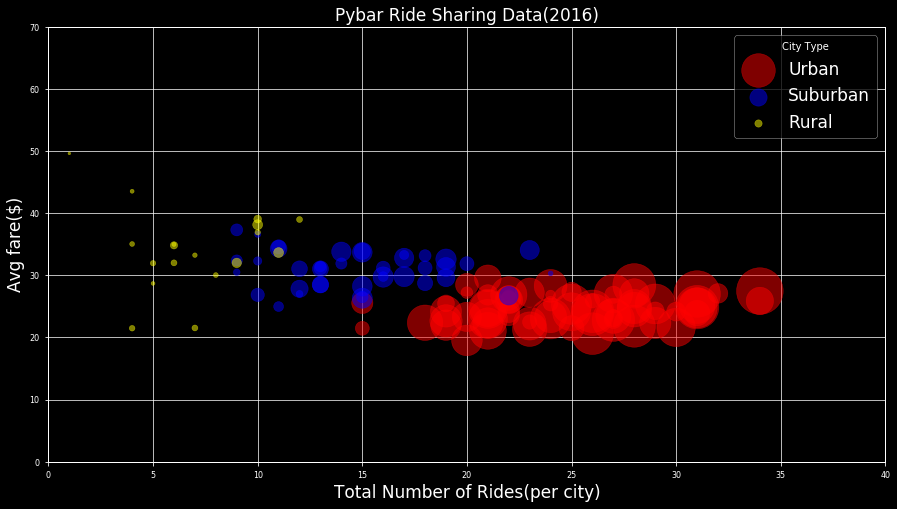
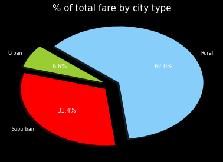
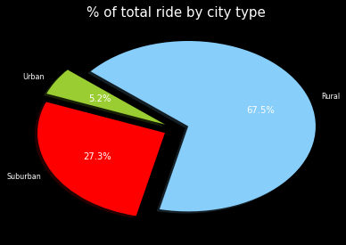
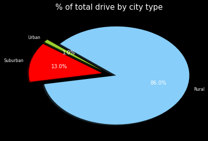

# Pybar

------------------------------------------------------------------------------------

## Analysis:

        Observed Trend1: in urban area, there are obviously more rides and in rural area, there are more drivers
        
        Observed Trend2: rural traveling fare is more than urban and suburban area
            
        Observed Trend3: very little people actually drive in urban area


```python
import pandas as pd
import matplotlib.pyplot as plt
import numpy as np
import seaborn as sb
```


```python
city = pd.read_csv('raw_data/city_data.csv').sort_values('city')
ride = pd.read_csv('raw_data/ride_data.csv').sort_values('city')
df = ride.merge(city, how = 'left', on = 'city')
df['type'].unique()

```


    array(['Urban', 'Suburban', 'Rural'], dtype=object)


```python
mask1 = df['type']=='Urban'
mask2 = df['type'] == 'Suburban'
mask3 = df['type']== 'Rural'
masklist = [mask1, mask2, mask3]
color= ['r','g','y']
labels = ['Urban', 'Suburban', 'Rural']
def avgFare_Rider_city(masks, labels, colors):
    
    temp_df = df[masks].groupby(['city','type']).agg({'fare':'mean', 'driver_count':'sum', 'ride_id':'count'})
    y = temp_df['fare']
    x = temp_df['ride_id']
    s= temp_df['driver_count']
    plot_df = plt.scatter(x = x, y=y, s =s,  alpha = 0.5, label = labels, c = colors)     
    return plot_df


```


```python
plt.style.use('dark_background')
fig = plt.figure(figsize = (15,8))

avgFare_Rider_city(mask1, 'Urban', 'red' )
avgFare_Rider_city(mask2, 'Suburban', 'blue')
avgFare_Rider_city(mask3, 'Rural','yellow')

plt.xlim(0,40)
plt.ylim(0,70)
plt.legend(title = 'City Type', fontsize = 17 ,loc = 'best')
plt.grid(alpha = 0.9, c = 'w')
plt.title('Pybar Ride Sharing Data(2016)', fontsize = 17)
plt.xlabel('Total Number of Rides(per city)', fontsize = 17)
plt.ylabel('Avg fare($)', fontsize = 17)
plt.show()

```





```python
plt.close()
```

## pie


```python
def metricsBy_cityType(metrics):
    labels = ['Urban', 'Suburban', 'Rural']
    
    colors = ["yellowgreen", "red",  "lightskyblue"]
    explode = (0.1, 0.1, 0.1)
    temp_df2= df.groupby('type').agg({'fare':'sum', 'driver_count':'sum', 'ride_id':'count'})
    pie_chart = plt.pie(temp_df2[metrics], labels=labels, colors=colors,
        autopct="%1.1f%%", shadow=True, startangle=140, explode = explode )
    return pie_chart
```


```python
plt.style.use(['seaborn-deep'])
metricsBy_cityType('fare')
plt.title('% of total fare by city type', fontsize = 15)

plt.show()

```





```python
plt.close()
```


```python
plt.style.use('seaborn-deep')
metricsBy_cityType('ride_id')
plt.title('% of total ride by city type', fontsize = 15)

plt.show()

plt.close()
```





```python
plt.style.use(['seaborn-deep'])
metricsBy_cityType('driver_count')
plt.title('% of total drive by city type', fontsize = 15)

plt.show()


```




