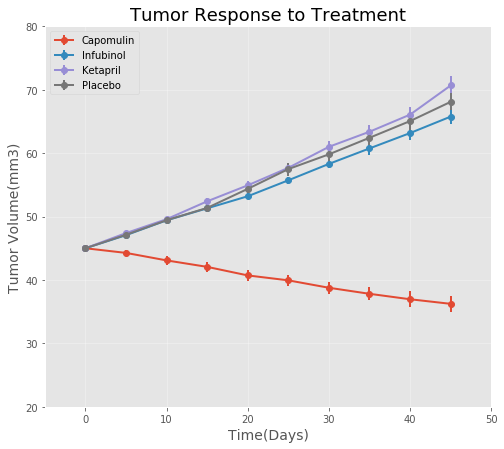
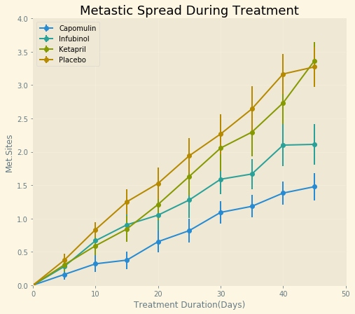
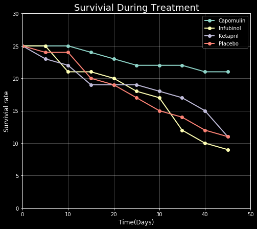
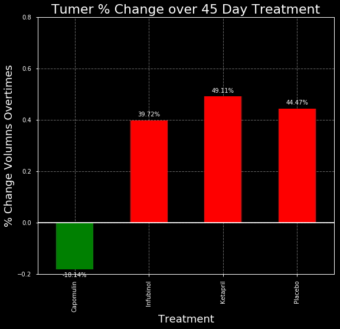

# Pymaceuticals.inc
---------------------------------------------------------------------------------

## Analysis:

       -Observed Trend 1: Capomulin has obvious effect in reducing tumor size in mouse object and shows the best survivial rate and optimistic Metstatic spread results.

       -Observed Trend 2: Placebo, Infubiol and Ketapril was not that effective in curing tumor and maintinaing survivial rate since they shows similer trend in all graphs.

       -Observed Trend 3: Capomulin shows negative amount of tumer size changes in terms of day to day


```python
import pandas as pd
import matplotlib.pyplot as plt
import numpy as np
```


```python
clinic = pd.read_csv('raw_data/clinicaltrial_data.csv')
mousedrug = pd.read_csv('raw_data/mouse_drug_data.csv')

len(mousedrug['Mouse ID'].unique())
mousedrug2 = mousedrug.sort_values('Mouse ID').set_index('Mouse ID')
df = clinic.merge(mousedrug, how= 'left', on= 'Mouse ID' )
df.head()
```


<div>
<style scoped>
    .dataframe tbody tr th:only-of-type {
        vertical-align: middle;
    }

    .dataframe tbody tr th {
        vertical-align: top;
    }

    .dataframe thead th {
        text-align: right;
    }
</style>
<table border="1" class="dataframe">
  <thead>
    <tr style="text-align: right;">
      <th></th>
      <th>Mouse ID</th>
      <th>Timepoint</th>
      <th>Tumor Volume (mm3)</th>
      <th>Metastatic Sites</th>
      <th>Drug</th>
    </tr>
  </thead>
  <tbody>
    <tr>
      <th>0</th>
      <td>b128</td>
      <td>0</td>
      <td>45.0</td>
      <td>0</td>
      <td>Capomulin</td>
    </tr>
    <tr>
      <th>1</th>
      <td>f932</td>
      <td>0</td>
      <td>45.0</td>
      <td>0</td>
      <td>Ketapril</td>
    </tr>
    <tr>
      <th>2</th>
      <td>g107</td>
      <td>0</td>
      <td>45.0</td>
      <td>0</td>
      <td>Ketapril</td>
    </tr>
    <tr>
      <th>3</th>
      <td>a457</td>
      <td>0</td>
      <td>45.0</td>
      <td>0</td>
      <td>Ketapril</td>
    </tr>
    <tr>
      <th>4</th>
      <td>c819</td>
      <td>0</td>
      <td>45.0</td>
      <td>0</td>
      <td>Ketapril</td>
    </tr>
  </tbody>
</table>
</div>


## Tumor Volume Analysis


```python
chosen_drug=['Capomulin', 'Infubinol','Ketapril', 'Placebo' ]
data_df = df.groupby(['Timepoint', 'Drug']).agg({'Tumor Volume (mm3)':'mean'}).unstack()['Tumor Volume (mm3)']
data_df.head()
```


<div>
<style scoped>
    .dataframe tbody tr th:only-of-type {
        vertical-align: middle;
    }

    .dataframe tbody tr th {
        vertical-align: top;
    }

    .dataframe thead th {
        text-align: right;
    }
</style>
<table border="1" class="dataframe">
  <thead>
    <tr style="text-align: right;">
      <th>Drug</th>
      <th>Capomulin</th>
      <th>Ceftamin</th>
      <th>Infubinol</th>
      <th>Ketapril</th>
      <th>Naftisol</th>
      <th>Placebo</th>
      <th>Propriva</th>
      <th>Ramicane</th>
      <th>Stelasyn</th>
      <th>Zoniferol</th>
    </tr>
    <tr>
      <th>Timepoint</th>
      <th></th>
      <th></th>
      <th></th>
      <th></th>
      <th></th>
      <th></th>
      <th></th>
      <th></th>
      <th></th>
      <th></th>
    </tr>
  </thead>
  <tbody>
    <tr>
      <th>0</th>
      <td>45.000000</td>
      <td>45.000000</td>
      <td>45.000000</td>
      <td>45.000000</td>
      <td>45.000000</td>
      <td>45.000000</td>
      <td>45.000000</td>
      <td>45.000000</td>
      <td>45.000000</td>
      <td>45.000000</td>
    </tr>
    <tr>
      <th>5</th>
      <td>44.266086</td>
      <td>46.503051</td>
      <td>47.062001</td>
      <td>47.389175</td>
      <td>46.796098</td>
      <td>47.125589</td>
      <td>47.248967</td>
      <td>43.944859</td>
      <td>47.527452</td>
      <td>46.851818</td>
    </tr>
    <tr>
      <th>10</th>
      <td>43.084291</td>
      <td>48.285125</td>
      <td>49.403909</td>
      <td>49.582269</td>
      <td>48.694210</td>
      <td>49.423329</td>
      <td>49.101541</td>
      <td>42.531957</td>
      <td>49.463844</td>
      <td>48.689881</td>
    </tr>
    <tr>
      <th>15</th>
      <td>42.064317</td>
      <td>50.094055</td>
      <td>51.296397</td>
      <td>52.399974</td>
      <td>50.933018</td>
      <td>51.359742</td>
      <td>51.067318</td>
      <td>41.495061</td>
      <td>51.529409</td>
      <td>50.779059</td>
    </tr>
    <tr>
      <th>20</th>
      <td>40.716325</td>
      <td>52.157049</td>
      <td>53.197691</td>
      <td>54.920935</td>
      <td>53.644087</td>
      <td>54.364417</td>
      <td>53.346737</td>
      <td>40.238325</td>
      <td>54.067395</td>
      <td>53.170334</td>
    </tr>
  </tbody>
</table>
</div>


```python
chosen_drug=['Capomulin', 'Infubinol','Ketapril', 'Placebo' ]
for treatments in chosen_drug:
        mask = df['Drug']== treatments
        error= df[mask].groupby('Timepoint')['Tumor Volume (mm3)'].sem()
error
```


    Timepoint
    0     0.000000
    5     0.218091
    10    0.402064
    15    0.614461
    20    0.839609
    25    1.034872
    30    1.218231
    35    1.287481
    40    1.370634
    45    1.351726
    Name: Tumor Volume (mm3), dtype: float64


```python
def Tumor_treatment_overtime(y, way):
    chosen_drug=['Capomulin', 'Infubinol','Ketapril', 'Placebo' ]
    data_df = df.groupby(['Timepoint', 'Drug']).agg({ y : way}).unstack()[y]
    
    for treatments in chosen_drug:
        mask = df['Drug']== treatments
        error= df[mask].groupby('Timepoint')[y].sem()
        plot = plt.errorbar(data_df.index, data_df[treatments], yerr=error, fmt='-o', label = treatments)
    return plot

```


```python
plt.style.use('ggplot')
fig1 = plt.figure(figsize = (8,7))
tumorSize = Tumor_treatment_overtime('Tumor Volume (mm3)', 'mean')
plt.plot(c = ['b','green','k','r'])
plt.legend(loc = 'best')
plt.ylim(20,80)
plt.xlim(-5,50)
plt.grid(alpha = 0.3)
plt.xlabel('Time(Days)', fontsize = 14)
plt.ylabel('Tumor Volume(mm3)', fontsize = 14)
plt.title('Tumor Response to Treatment', fontsize = 18)


plt.show()

```





```python
#plt.savefig('Tumor Response to Treatment')
plt.close()
```

## Metastatic Sites Analysis


```python
data_df = df.groupby(['Timepoint', 'Drug']).agg({'Metastatic Sites':'mean'}).unstack()['Metastatic Sites']
data_df.head()
```


<div>
<style scoped>
    .dataframe tbody tr th:only-of-type {
        vertical-align: middle;
    }

    .dataframe tbody tr th {
        vertical-align: top;
    }

    .dataframe thead th {
        text-align: right;
    }
</style>
<table border="1" class="dataframe">
  <thead>
    <tr style="text-align: right;">
      <th>Drug</th>
      <th>Capomulin</th>
      <th>Ceftamin</th>
      <th>Infubinol</th>
      <th>Ketapril</th>
      <th>Naftisol</th>
      <th>Placebo</th>
      <th>Propriva</th>
      <th>Ramicane</th>
      <th>Stelasyn</th>
      <th>Zoniferol</th>
    </tr>
    <tr>
      <th>Timepoint</th>
      <th></th>
      <th></th>
      <th></th>
      <th></th>
      <th></th>
      <th></th>
      <th></th>
      <th></th>
      <th></th>
      <th></th>
    </tr>
  </thead>
  <tbody>
    <tr>
      <th>0</th>
      <td>0.000000</td>
      <td>0.000000</td>
      <td>0.000000</td>
      <td>0.000000</td>
      <td>0.000000</td>
      <td>0.000000</td>
      <td>0.000000</td>
      <td>0.000000</td>
      <td>0.000000</td>
      <td>0.000000</td>
    </tr>
    <tr>
      <th>5</th>
      <td>0.160000</td>
      <td>0.380952</td>
      <td>0.280000</td>
      <td>0.304348</td>
      <td>0.260870</td>
      <td>0.375000</td>
      <td>0.320000</td>
      <td>0.120000</td>
      <td>0.240000</td>
      <td>0.166667</td>
    </tr>
    <tr>
      <th>10</th>
      <td>0.320000</td>
      <td>0.600000</td>
      <td>0.666667</td>
      <td>0.590909</td>
      <td>0.523810</td>
      <td>0.833333</td>
      <td>0.565217</td>
      <td>0.250000</td>
      <td>0.478261</td>
      <td>0.500000</td>
    </tr>
    <tr>
      <th>15</th>
      <td>0.375000</td>
      <td>0.789474</td>
      <td>0.904762</td>
      <td>0.842105</td>
      <td>0.857143</td>
      <td>1.250000</td>
      <td>0.764706</td>
      <td>0.333333</td>
      <td>0.782609</td>
      <td>0.809524</td>
    </tr>
    <tr>
      <th>20</th>
      <td>0.652174</td>
      <td>1.111111</td>
      <td>1.050000</td>
      <td>1.210526</td>
      <td>1.150000</td>
      <td>1.526316</td>
      <td>1.000000</td>
      <td>0.347826</td>
      <td>0.952381</td>
      <td>1.294118</td>
    </tr>
  </tbody>
</table>
</div>


```python
chosen_drug=['Capomulin', 'Infubinol','Ketapril', 'Placebo' ]
for treatments in chosen_drug:
        mask = df['Drug']== treatments
        error= df[mask].groupby('Timepoint')['Metastatic Sites'].sem()
error
```


    Timepoint
    0     0.000000
    5     0.100947
    10    0.115261
    15    0.190221
    20    0.234064
    25    0.263888
    30    0.300264
    35    0.341412
    40    0.297294
    45    0.304240
    Name: Metastatic Sites, dtype: float64


```python

plt.style.use('Solarize_Light2')
fig1 = plt.figure(figsize = (8,7))
Metast= Tumor_treatment_overtime('Metastatic Sites', 'mean')
plt.plot(c = ['b','green','k','r'])
plt.ylim(0,4)
plt.xlim(0,50)
plt.legend(loc = 'upper left')
plt.grid(alpha = 0.3)
plt.xlabel('Treatment Duration(Days)')
plt.ylabel('Met.Sites')
plt.title('Metastic Spread During Treatment', fontsize = 18)


plt.show()
```





```python
#plt.savefig('Metastic Spread During Treatment')
plt.close()
```

## Survival Rate Analysis


```python
mouse_count= df.groupby(['Drug', 'Timepoint'])
mouse_count= mouse_count.agg({'Mouse ID':'count'})
mouse_count.head()
```


<div>
<style scoped>
    .dataframe tbody tr th:only-of-type {
        vertical-align: middle;
    }

    .dataframe tbody tr th {
        vertical-align: top;
    }

    .dataframe thead th {
        text-align: right;
    }
</style>
<table border="1" class="dataframe">
  <thead>
    <tr style="text-align: right;">
      <th></th>
      <th></th>
      <th>Mouse ID</th>
    </tr>
    <tr>
      <th>Drug</th>
      <th>Timepoint</th>
      <th></th>
    </tr>
  </thead>
  <tbody>
    <tr>
      <th rowspan="5" valign="top">Capomulin</th>
      <th>0</th>
      <td>25</td>
    </tr>
    <tr>
      <th>5</th>
      <td>25</td>
    </tr>
    <tr>
      <th>10</th>
      <td>25</td>
    </tr>
    <tr>
      <th>15</th>
      <td>24</td>
    </tr>
    <tr>
      <th>20</th>
      <td>23</td>
    </tr>
  </tbody>
</table>
</div>


```python
def Tumor_survival_overtime(y, way):
    chosen_drug=['Capomulin', 'Infubinol','Ketapril', 'Placebo' ]
    data_df = df.groupby(['Timepoint', 'Drug']).agg({ y : way}).unstack()[y]
    
    for treatments in chosen_drug:
        plot = plt.errorbar(data_df.index, data_df[treatments], fmt='-o', label = treatments)
    return plot
```


```python
plt.style.use('dark_background')
fig1 = plt.figure(figsize = (8,7))
survovial_rate= Tumor_survival_overtime('Mouse ID', 'count')
plt.plot(c = ['b','green','k','r'])
plt.ylim(0,30)
plt.xlim(0,50)
plt.legend(loc = 'best')
plt.grid(alpha = 0.3)
plt.xlabel('Time(Days)')
plt.ylabel('Survivial rate')
plt.title('Survivial During Treatment', fontsize = 18)


plt.show()
    
```


    <matplotlib.figure.Figure at 0x118c4c8d0>





```python
#plt.savefig('Survivial rate')
plt.close()
```

## Summery


```python
chosen_drug=['Capomulin', 'Infubinol','Ketapril', 'Placebo' ]
data_df = df.groupby(['Timepoint', 'Drug']).agg({'Tumor Volume (mm3)':'mean'}).unstack()['Tumor Volume (mm3)']
data_df.head()

```


<div>
<style scoped>
    .dataframe tbody tr th:only-of-type {
        vertical-align: middle;
    }

    .dataframe tbody tr th {
        vertical-align: top;
    }

    .dataframe thead th {
        text-align: right;
    }
</style>
<table border="1" class="dataframe">
  <thead>
    <tr style="text-align: right;">
      <th>Drug</th>
      <th>Capomulin</th>
      <th>Ceftamin</th>
      <th>Infubinol</th>
      <th>Ketapril</th>
      <th>Naftisol</th>
      <th>Placebo</th>
      <th>Propriva</th>
      <th>Ramicane</th>
      <th>Stelasyn</th>
      <th>Zoniferol</th>
    </tr>
    <tr>
      <th>Timepoint</th>
      <th></th>
      <th></th>
      <th></th>
      <th></th>
      <th></th>
      <th></th>
      <th></th>
      <th></th>
      <th></th>
      <th></th>
    </tr>
  </thead>
  <tbody>
    <tr>
      <th>0</th>
      <td>45.000000</td>
      <td>45.000000</td>
      <td>45.000000</td>
      <td>45.000000</td>
      <td>45.000000</td>
      <td>45.000000</td>
      <td>45.000000</td>
      <td>45.000000</td>
      <td>45.000000</td>
      <td>45.000000</td>
    </tr>
    <tr>
      <th>5</th>
      <td>44.266086</td>
      <td>46.503051</td>
      <td>47.062001</td>
      <td>47.389175</td>
      <td>46.796098</td>
      <td>47.125589</td>
      <td>47.248967</td>
      <td>43.944859</td>
      <td>47.527452</td>
      <td>46.851818</td>
    </tr>
    <tr>
      <th>10</th>
      <td>43.084291</td>
      <td>48.285125</td>
      <td>49.403909</td>
      <td>49.582269</td>
      <td>48.694210</td>
      <td>49.423329</td>
      <td>49.101541</td>
      <td>42.531957</td>
      <td>49.463844</td>
      <td>48.689881</td>
    </tr>
    <tr>
      <th>15</th>
      <td>42.064317</td>
      <td>50.094055</td>
      <td>51.296397</td>
      <td>52.399974</td>
      <td>50.933018</td>
      <td>51.359742</td>
      <td>51.067318</td>
      <td>41.495061</td>
      <td>51.529409</td>
      <td>50.779059</td>
    </tr>
    <tr>
      <th>20</th>
      <td>40.716325</td>
      <td>52.157049</td>
      <td>53.197691</td>
      <td>54.920935</td>
      <td>53.644087</td>
      <td>54.364417</td>
      <td>53.346737</td>
      <td>40.238325</td>
      <td>54.067395</td>
      <td>53.170334</td>
    </tr>
  </tbody>
</table>
</div>


```python
data3= data_df.ix[data_df.index , chosen_drug]
list3 = []
for i in chosen_drug :
    change_deci =(data3.loc[45,i] - data3.loc[5,i])/data3.loc[5,i]
    list3.append(change_deci)
Series2 = pd.Series(list3, chosen_drug)
Series2

```

    /Users/apple/anaconda3/lib/python3.6/site-packages/ipykernel_launcher.py:2: DeprecationWarning: 
    .ix is deprecated. Please use
    .loc for label based indexing or
    .iloc for positional indexing
    
    See the documentation here:
    http://pandas.pydata.org/pandas-docs/stable/indexing.html#ix-indexer-is-deprecated
      


    Capomulin   -0.181402
    Infubinol    0.397211
    Ketapril     0.491120
    Placebo      0.444737
    dtype: float64


```python
y = pd.DataFrame(Series2)
plt.style.use('seaborn-notebook')
fig = plt.figure(figsize=(9,8))
ax = y.ix[['Capomulin', 'Infubinol', 'Ketapril','Placebo' ], 0].plot(kind = 'bar', colors = ['g', 'r','r','r'])
plt.grid(alpha = 0.4, linestyle = '--')
plt.xlabel('Treatment', fontsize = 18)
plt.ylabel('% Change Volumns Overtimes', fontsize = 18)
plt.title("Tumer % Change over 45 Day Treatment", fontsize = 22)
plt.ylim(-0.2, 0.8)

x_axis = np.arange(len(['Capomulin', 'Infubinol', 'Ketapril','Placebo' ]))
tick_locations = [value for value in x_axis]
plt.xticks(tick_locations,['Capomulin', 'Infubinol', 'Ketapril','Placebo' ])

rects = ax.patches


for rect in rects:
    
    y_value = rect.get_height()
    x_value = rect.get_x() + rect.get_width() / 2
    space = 5    
    va = 'bottom'
    
    if y_value < 0:        
        space *= -1      
        va = 'top'    
    label = "{:.2%}".format(y_value)  
    plt.annotate(
        label,                      # Use `label` as label
        (x_value, y_value),         # Place label at end of the bar
        xytext=(0, space),          # Vertically shift label by `space`
        textcoords="offset points", # Interpret `xytext` as offset in points
        ha='center',                # Horizontally center label
        va=va) 
plt.axhline(y=0, color='w', linestyle='-')
plt.show()
```

    /Users/apple/anaconda3/lib/python3.6/site-packages/ipykernel_launcher.py:4: DeprecationWarning: 
    .ix is deprecated. Please use
    .loc for label based indexing or
    .iloc for positional indexing
    
    See the documentation here:
    http://pandas.pydata.org/pandas-docs/stable/indexing.html#ix-indexer-is-deprecated
      after removing the cwd from sys.path.
    /Users/apple/anaconda3/lib/python3.6/site-packages/pandas/plotting/_core.py:186: UserWarning: 'colors' is being deprecated. Please use 'color'instead of 'colors'
      warnings.warn(("'colors' is being deprecated. Please use 'color'"





```python
plt.savefig('Tumor Summery')
plt.close()
```
